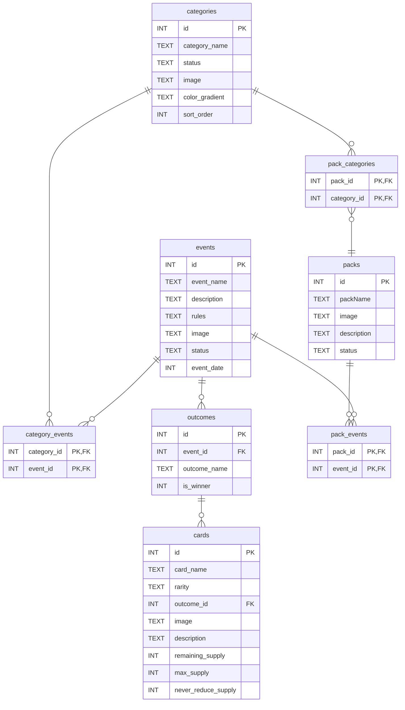

# SQLite Database Schema

```mermaid
erDiagram
    categories {
        INT id PK
        TEXT category_name
        TEXT status
        TEXT image
        TEXT color_gradient
        INT sort_order
    }
    events {
        INT id PK
        TEXT event_name
        TEXT description
        TEXT rules
        TEXT image
        TEXT status
        INT event_date
    }
    category_events {
        INT category_id PK,FK
        INT event_id PK,FK
    }
    outcomes {
        INT id PK
        INT event_id FK
        TEXT outcome_name
        INT is_winner
    }
    packs {
        INT id PK
        TEXT packName
        TEXT image
        TEXT description
        TEXT status
    }
    pack_categories {
        INT pack_id PK,FK
        INT category_id PK,FK
    }
    pack_events {
        INT pack_id PK,FK
        INT event_id PK,FK
    }
    cards {
        INT id PK
        TEXT card_name
        TEXT rarity
        INT outcome_id FK
        TEXT image
        TEXT description
        INT remaining_supply
        INT max_supply
        INT never_reduce_supply
    }

    pack_categories }o--|| packs : ""
    categories ||--o{ category_events : ""
    events ||--o{ category_events : ""
    events ||--o{ outcomes : ""
    outcomes ||--o{ cards : ""
    categories ||--o{ pack_categories : ""
    packs ||--o{ pack_events : ""
    events ||--o{ pack_events : ""
```
